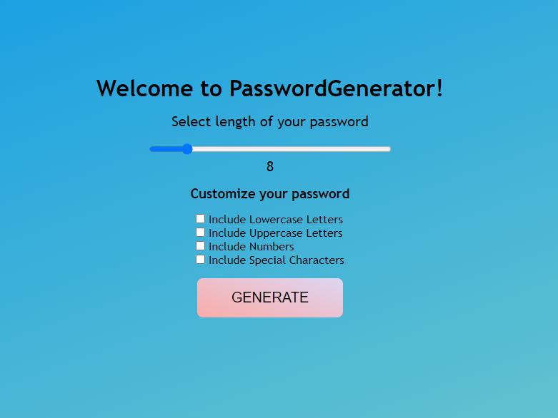
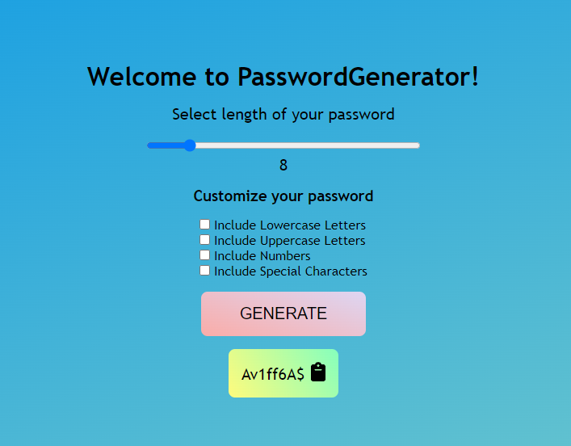

# Password Generator

This project was developed to help users generate strong passwords based on their criteria selection.

## Description

In this repository, I created a responsive website to let users select their password criterias such as password length, lowercase, uppercase, numbers and special characters. As they click on "Generate" button, their generated password will be diplayed at the bottom. Users can click on the password string to copy the password onto their clipboard.

If the user does not select any criteria and click on "Generate" button,the system will generate default password string based on predefined criterias as below:
- Password length is 8 characters long
- Includes all criterias shown with checkboxes

Additionally, randomly generated passwords are being tested for their strength to make sure selected criterias are being met.

Password Length Criteria:
- Users can select password length between 6-20 characters.

## Link to Site

https://ladparth.github.io/password-generator/

This project was built with HTML, CSS, and JavaScript

## Screenshots

## Result

